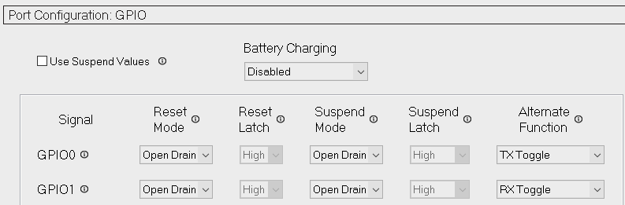
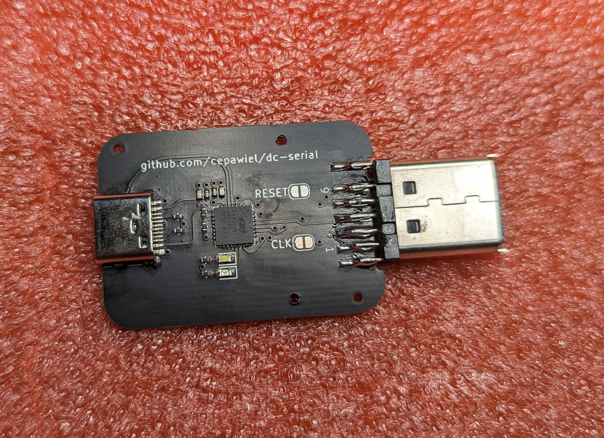
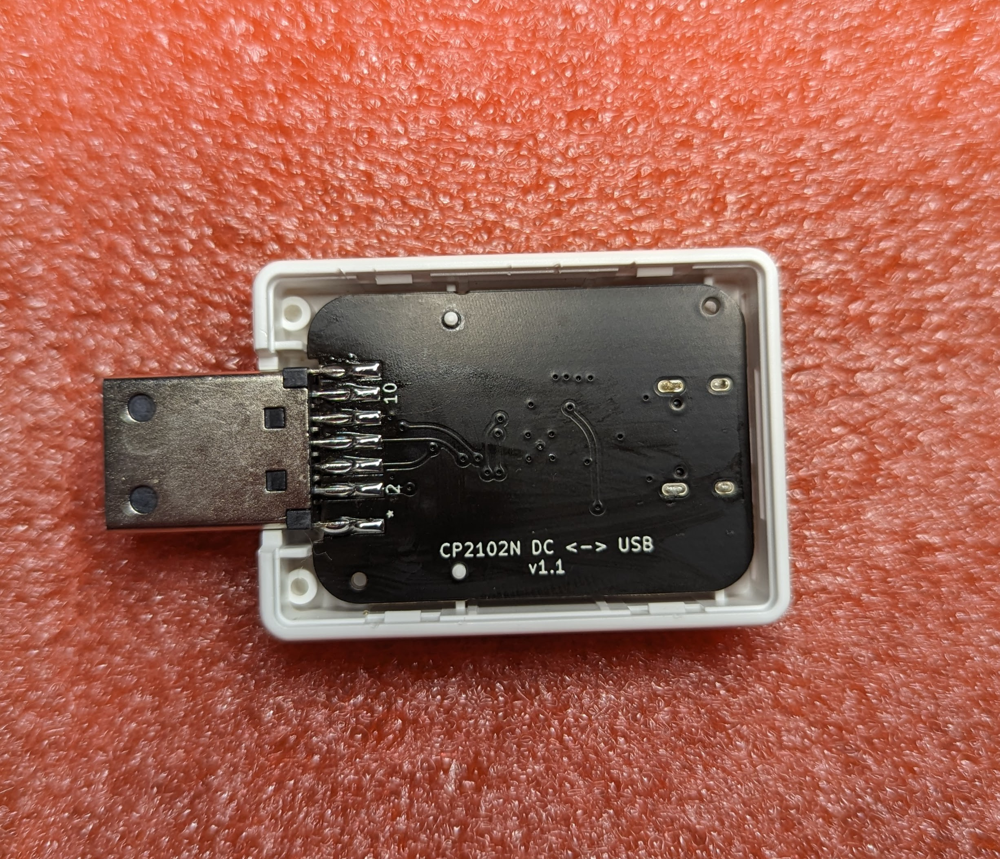
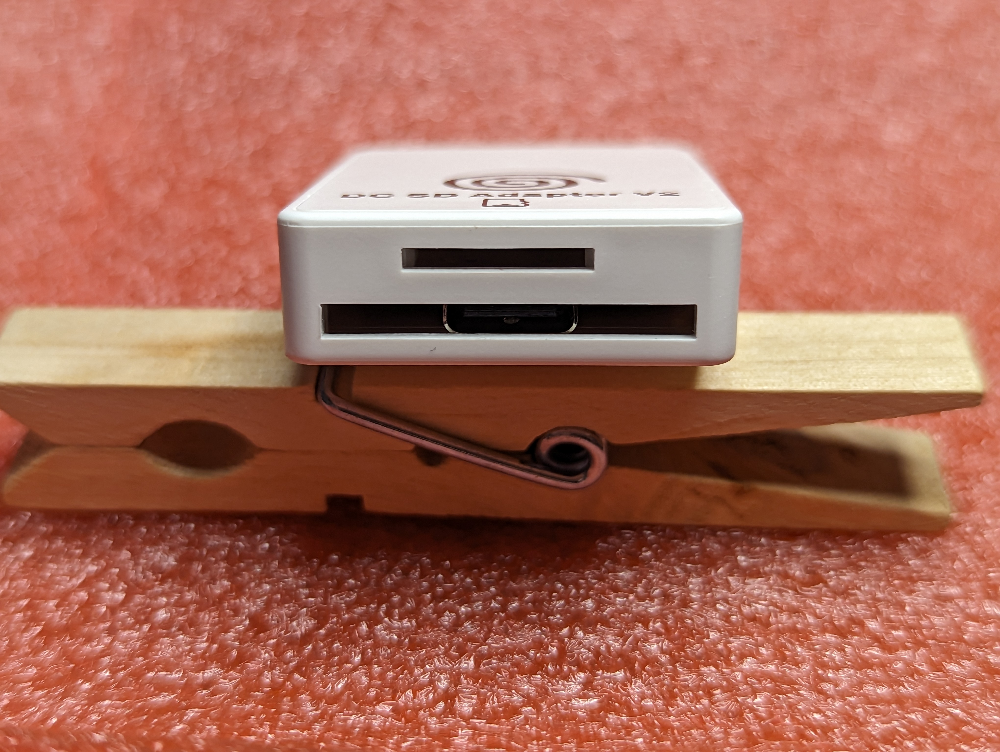
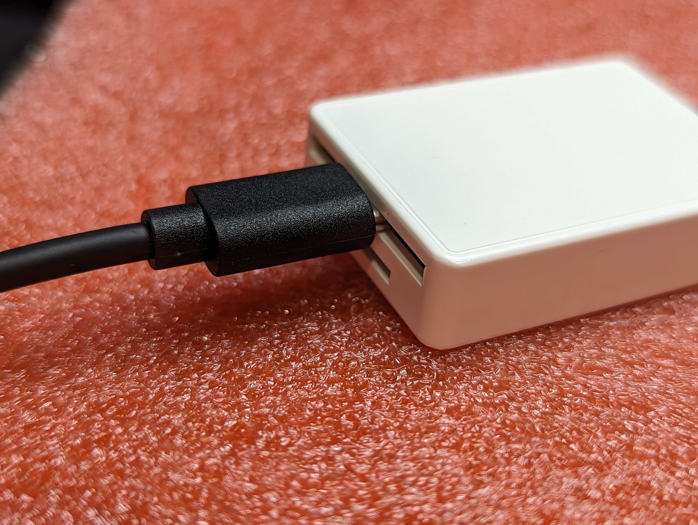

# CP2102N Adapter

## Info
This is a serial adapter designed around the CP2102N USB <-> Serial IC. 

On the PCB there's solder jumpers for connecting the clock and serial pins. I haven't experimented with using them yet, but that was the intention behind including them.

## Programing
By default the LEDs are not enabled, but can be using the [USBXpress]() software from Silicon Labs. Various other options include setting the Manufacturer & Product Strings. A [brief guide](https://www.silabs.com/documents/public/application-notes/AN721.pdf) to the tool is avaiable. To enable the LEDs make sure the "Alternate Function" for GPIO0 & 1 are set to the TX & RX Toggle options.

## Ordering
Files for ordering from JLCPCB are avaiable [here](jlcpcb/production_files/) including assembly files. I do usually select the option for them to double check the pick and place file since I believe I'm doing something incorrect with respect to the origin. In addition to the PCBs and components you'll need to procure a Dreamcast SD Adapter that are avaiable on Aliexpress/Ebay/Amazon ($10-$20) for the serial connector.

## Photos

## Changelog

### TODO
- Current PCB alignment holes are slightly too small. Using a 3/64" bit to widen holes allows for a pretty good fit.

### V1.1
- Swapped RX/TX & RTS/CTS
- Placed components on bottom to allow USB-C to fit without modifications to case

### V1.0
- Initial Order